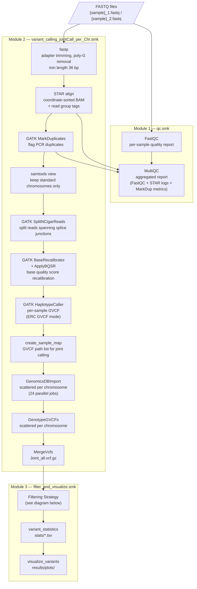
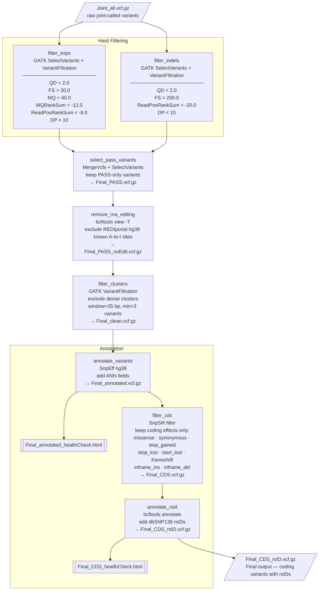

# Snakemake GATK RNA-seq Variant Calling Workflow

A reproducible Snakemake pipeline for RNA-seq variant calling following GATK
Best Practices. Supports both local workstations and HPC/Slurm environments.
Every scientific tool (STAR, GATK, fastp, FastQC, MultiQC, bcftools, SnpEff,
SnpSift, SRA toolkit) runs inside a pinned Singularity/Apptainer container —
the only software you install on the host is Snakemake itself.

**At a glance:** GATK Best-Practices RNA-seq variant calling that runs unchanged
on a local workstation or a SLURM HPC cluster; the only host-side dependency is
Snakemake — every scientific tool runs from a pinned container.

**Contents**

- **[1 · Using the pipeline](#1--using-the-pipeline)** — requirements, what you need to change, and end-to-end walkthroughs for HPC and local.
- **[2 · How the workflow works](#2--how-the-workflow-works)** — features, the pipeline and filtering diagrams, and outputs.
- **[3 · Reference & troubleshooting](#3--reference--troubleshooting)** — repo layout, reference files, configuration, disk/runtime, recovery, and containers.

---

## 1 · Using the pipeline

### Requirements

- **Snakemake** — the only host-side software you must install.
  Install however you prefer:
  ```bash
  conda env create -f workflow/envs/snakemake.yaml      # or: mamba / micromamba
  conda activate snakemake_env
  ```
  Other valid options: `pip install snakemake snakemake-executor-plugin-slurm`
  in a venv, or `module load snakemake` on HPC systems with environment modules.
- **Apptainer or Singularity** — required. Every scientific tool runs from a
  pinned biocontainer pulled on first use.
- No manual installation of GATK, STAR, samtools, SnpEff, SnpSift, SRA toolkit,
  bcftools, etc. — they all run from containers.

Run `bash workflow/scripts/check_prerequisites.sh` to verify your host before
starting.

---

### What you need to change

The pipeline code is fixed — you only touch **environment variables** and
files in **`config/`**. Everything you might change, by situation:

| Your situation | What you set / edit |
|---|---|
| **Run on HPC** | Env vars `SLURM_ACCOUNT`, `SLURM_PARTITION` (required) and `HPC_SCRATCH_DIR` (recommended). Plus `partition_max_runtime` in `config/config.yaml` *only* if your partition's MaxTime is under 5 days. |
| **Run the demo (GSE256519)** | Nothing — `config/units.tsv` ships pre-filled. |
| **Run your own data** | Replace the GSE256519 demo FASTQs with your own, then update two files in `config/`: regenerate `config/units.tsv` with `make_units.sh`, and set `sequencing_type` in `config/config.yaml`. See [Configuration § Sample sheet](#sample-sheet-configunitstsv). |

---

### Usage Example

Two complete, self-contained walkthroughs of the GSE256519 demo (human heart
RNA-seq, paired-end 2×150 bp) — follow the one that matches where you run. For
your own data, see [What you need to change](#what-you-need-to-change).

#### A. Run on HPC (SLURM) — end to end

> ⚠️ Run all of this from a **login node** (e.g. `int*`), **not a compute node**.
> `run.sh` and the download wrappers self-submit their own SLURM jobs — you only
> launch them.

**1. Clone the repository** (onto scratch is recommended — fast disk, large quota):

```bash
git clone https://github.com/ManHUU/snakemake-gatk-rna-workflow.git
cd snakemake-gatk-rna-workflow
```

> **Scratch purge & backup caveat.** Running on scratch is supported and
> recommended, but scratch is **auto-purged and not backed up** (on Snellius
> `/scratch-shared` ≈ 14 days). Don't let a run idle past the purge window, keep a
> durable copy of references if you reuse them, and copy `results/` off scratch
> when the run completes.

**2. Install Snakemake** — the only host-side install:

```bash
conda env create -f workflow/envs/snakemake.yaml   # first time only
conda activate snakemake_env
```

Every scientific tool runs from a container, and `apptainer`/`singularity` is
already on `PATH` on most HPCs (incl. Snellius). If it isn't, `run.sh` stops with
a clear message telling you to `module load apptainer`.

**3. Set HPC settings** — environment variables; you never edit pipeline code:
```bash
export SLURM_ACCOUNT=<your_account>
export SLURM_PARTITION=<your_partition>           # e.g. genoa
```

| Variable | Required? | What it is |
|---|---|---|
| `SLURM_ACCOUNT` | **Required** | Your SLURM account / billing budget. |
| `SLURM_PARTITION` | **Required** | The partition jobs run on (e.g. `genoa`). |
| `HPC_SCRATCH_DIR` | Recommended | Fast scratch where apptainer builds its multi-GB images. If set it always wins; if unset, `run.sh` auto-detects (`$SCRATCH`, `/scratch-shared/$USER`, `/scratch/$USER`) and prints the resolved path. |


One per-site value is **not** an env var: `partition_max_runtime` in
`config/config.yaml` (your partition's MaxTime in minutes; default 7200 = 5 days).
Lower it only if your partition's limit is lower.

**4. Download reference files** (self-submits via sbatch):

```bash
bash workflow/scripts/download_refs.slurm
```

**5. Download the demo FASTQs:**

```bash
bash workflow/scripts/download_GSE256519.slurm
```

`config/units.tsv` ships pre-filled for this dataset — no edits.

**6. Dry run** — plans on the login node, submits nothing:

```bash
bash run.sh --dry-run
```

You should see all rules for both samples across 24 chromosomes, no errors.

**7. Run** — self-submits an orchestrator job that scatters the per-rule jobs:

```bash
bash run.sh
# resume a previous run, reusing work already on disk:
bash run.sh --rerun-triggers mtime
```

**8. Monitor:**

```bash
squeue -u $USER
tail -f logs/gatk_pipeline_<jobid>.log
```

**9. Check outputs** — see [Expected output](#expected-output) below.

**10. (optional) Provenance report** — DAG, runtimes, software/provenance, as
supplementary material (runs locally in seconds):

```bash
bash run.sh --report report.html
```

#### B. Run on a local workstation — end to end

**1. Clone the repository:**

```bash
git clone https://github.com/ManHUU/snakemake-gatk-rna-workflow.git
cd snakemake-gatk-rna-workflow
```

**2. Install Snakemake** (Apptainer/Singularity must also be installed; `run.sh`
tells you if it's missing):

```bash
conda env create -f workflow/envs/snakemake.yaml   # first time only
conda activate snakemake_env
```

**3. Download reference files:**

```bash
bash workflow/scripts/download_refs.sh
```

**4. Download the demo FASTQs:**

```bash
bash workflow/scripts/download_GSE256519.sh
```

`config/units.tsv` ships pre-filled for this dataset — no edits.

**5. Dry run:**

```bash
bash run.sh --dry-run
```

> If your workstation has the SLURM client (`sbatch`) installed, `run.sh` would
> assume it's an HPC submit node and ask for `SLURM_ACCOUNT`/`SLURM_PARTITION`.
> Force a plain local run: `export FORCE_LOCAL=1`.

**6. Run** — uses 8 cores by default (change in `workflow/profiles/local/config.yaml`):

```bash
bash run.sh
```

For long runs, launch from a `screen` (or `tmux`) session so it survives
disconnection:

```bash
screen -S gatk_run
bash run.sh
# Detach with Ctrl+A then D; reattach later with: screen -r gatk_run
```

**7. Check outputs** — see [Expected output](#expected-output) below.

**8. (optional) Provenance report:** `bash run.sh --report report.html`

#### Expected output

```
results/
├── qc/
│   └── multiqc_report.html          # FastQC + STAR + MarkDuplicates QC
├── Final_CDS_rsID.vcf.gz            # Final output: coding variants with rsIDs
├── Final_annotated_healthCheck.html # SnpEff report (all variants)
├── Final_CDS_healthCheck.html       # SnpEff report (coding variants only)
├── stats/
│   ├── quality_metrics.tsv
│   ├── filter_summary.tsv
│   ├── chrom_counts.tsv
│   ├── sample_counts.tsv
│   └── ts_tv.tsv
└── plots/
    ├── variant_type_summary.png / .pdf
    ├── filter_summary.png / .pdf
    ├── quality_distributions.png / .pdf
    ├── chrom_distribution.png / .pdf
    ├── sample_counts.png / .pdf
    └── ts_tv_comparison.png / .pdf
```

---

## 2 · How the workflow works

### Features

- Paired-end and single-end FASTQ support (set one flag in config)
- Adapter trimming with fastp
- Raw read quality control with FastQC + MultiQC
- STAR 2-pass alignment with read group tagging
- GATK Best Practices: MarkDuplicates → SplitNCigarReads → BQSR → HaplotypeCaller
- Scalable joint genotyping: GenomicsDBImport + GenotypeGVCFs scattered per chromosome
- Type-specific hard filtering (SNP and INDEL, RNA-seq tuned thresholds)
- RNA editing site removal (REDIportal hg38)
- Dense variant cluster filtering
- Functional annotation with SnpEff (hg38)
- CDS-only filter: retains coding variants (missense, frameshift, stop, etc.)
- rsID annotation from dbSNP138
- Publication-quality figures (6 plots, PNG + PDF)
- Runs locally or on Slurm HPC with no code changes

---

### Pipeline Workflow

The pipeline is split into three rule modules, executed in order.



> **Parallelism**: HaplotypeCaller runs per sample in parallel. GenomicsDBImport
> and GenotypeGVCFs each run as 24 independent jobs (one per chromosome — chr1–22, chrX, chrY),
> then MergeVcfs collects the results.

---

### Filtering Strategy



---

### Outputs

| Path | Description |
|---|---|
| `results/qc/multiqc_report.html` | Aggregated QC (FastQC + STAR + MarkDuplicates) |
| `results/Joint_all.vcf.gz` | Raw joint-called variants (pre-filter) |
| `results/Final_PASS.vcf.gz` | Hard-filtered PASS variants |
| `results/Final_PASS_noEdit.vcf.gz` | RNA editing sites removed |
| `results/Final_clean.vcf.gz` | Dense clusters removed |
| `results/Final_annotated.vcf.gz` | SnpEff functional annotation |
| `results/Final_CDS.vcf.gz` | Coding variants only |
| `results/Final_CDS_rsID.vcf.gz` | **Final output** — coding variants with rsIDs |
| `results/Final_annotated_healthCheck.html` | SnpEff summary (all variants) |
| `results/Final_CDS_healthCheck.html` | SnpEff summary (coding variants) |
| `results/stats/quality_metrics.tsv` | Per-variant QD, FS, MQ, DP (pre-filter) |
| `results/stats/ts_tv.tsv` | Ts/Tv ratio before and after filtering |
| `results/plots/` | 6 publication-quality figures (PNG + PDF) |

#### Figures generated

| Figure | Description |
|---|---|
| `variant_type_summary` | SNP / INDEL counts, PASS vs filtered |
| `filter_summary` | Total PASS vs filtered (log scale) |
| `quality_distributions` | QD and DP histograms per variant type |
| `chrom_distribution` | Per-chromosome variant counts |
| `sample_counts` | Per-sample coding variant counts |
| `ts_tv_comparison` | Ts/Tv counts and ratio before vs after filtering |

---

## 3 · Reference & troubleshooting

### Repository Structure

```
.
├── Snakefile                          # Main entry point
├── run.sh                             # Unified runner — local OR SLURM (auto-detect)
├── config/
│   ├── config.yaml                    # All user-facing settings
│   └── units.tsv                      # Sample sheet (sample / unit / fq1 / fq2)
├── workflow/
│   ├── envs/
│   │   └── snakemake.yaml             # Snakemake 9 + slurm executor plugin (only host-side env)
│   ├── profiles/
│   │   ├── local/config.yaml          # Snakemake profile for local runs
│   │   └── slurm/config.yaml          # Snakemake profile for SLURM HPC runs
│   ├── schemas/
│   │   ├── config.schema.yaml         # JSON schema validating config.yaml
│   │   └── units.schema.yaml          # JSON schema validating the sample sheet
│   ├── rules/
│   │   ├── qc.smk                     # Module 1: FastQC + MultiQC
│   │   ├── variant_calling_jointCall_per_Chr.smk   # Module 2: fastp → STAR → GATK
│   │   └── filter_and_visualize.smk   # Module 3: filtering → annotation → plots
│   └── scripts/
│       ├── download_refs.sh           # Download all reference databases (checksum + Zenodo fallback)
│       ├── download_refs.slurm        # Thin SLURM wrapper around download_refs.sh
│       ├── make_units.sh              # Generate config/units.tsv from a FASTQ dir (run once)
│       ├── download_GSE256519.sh      # Download example test data (SRA)
│       ├── download_GSE256519.slurm   # SLURM wrapper for the test-data download
│       └── visualize_variants.py      # Variant visualization script
├── resources/                         # Reference files (not tracked by git)
└── data/                              # Input FASTQ files (not tracked by git)
```

> **Files an HPC reader must touch:** none. Set the two env vars
> `SLURM_ACCOUNT` and `SLURM_PARTITION` for your cluster (see Usage Example).
> Local readers edit nothing.

---

### Reference Files

Download all required references with the provided script. Output paths
already match `config/config.yaml`, so no edits are required afterwards.
Step 5/5 (SnpEff hg38 database) runs `snpEff` from the same biocontainer
the pipeline uses — apptainer/singularity must be on PATH.

```bash
# Local (or HPC interactive node):
bash workflow/scripts/download_refs.sh

# HPC via SLURM — uses the same env vars as run.sh (set them once per shell):
export SLURM_ACCOUNT=<your_slurm_account>
export SLURM_PARTITION=<your_slurm_partition>
bash workflow/scripts/download_refs.slurm   # self-submits via sbatch
```

This downloads:

| File | Source | Used by |
|---|---|---|
| GRCh38 primary assembly FASTA | EBI / GENCODE | STAR index, GATK |
| GENCODE v44 GTF | EBI / GENCODE | STAR index |
| Mills & 1000G gold standard indels (hg38) | Broad Institute | BQSR |
| dbSNP138 hg38 VCF | Broad Institute | BQSR, rsID annotation |
| REDIportal v2.0 hg38 BED | rediportal.cloud.ba.infn.it | RNA editing filter |
| SnpEff hg38 database | snpeff.blob.core.windows.net | Functional annotation |

#### Integrity checking and fallback mirror

Every download is verified against a pinned **sha256** checksum immediately after
fetching (see the `SHA_*` values and the `fetch_with_fallback` / `verify_sha256`
helpers at the top of `download_refs.sh`). A corrupted, truncated, or silently
changed file fails loudly instead of poisoning the run, and re-running the script
skips anything already present and verified.

The two link-rot-prone files — the REDIportal BED and the SnpEff hg38 database —
are also archived on Zenodo as a permanent fallback. If the upstream host is
unreachable, the script automatically falls back to the Zenodo copy and verifies
the same checksum:

> **Zenodo archive (DOI):** https://zenodo.org/records/21030946

---

### Configuration

All settings are in `config/config.yaml`:

```yaml
fastq_dir: "data/GSE256519"      # only used by make_units.sh, not at runtime
output_dir: "results"
log_dir: "logs"

units: "config/units.tsv"        # sample sheet (sample / unit / fq1 / fq2)

sequencing_type: "paired"        # "paired" or "single"
                                 # paired  → {sample}_1.fastq + {sample}_2.fastq
                                 # single  → {sample}.fastq
```

`config/config.yaml` and the sample sheet are validated against JSON schemas in
`workflow/schemas/` at DAG-build time, so a mistyped field or missing path fails
immediately with a clear message instead of mid-run.

#### Sample sheet (`config/units.tsv`)

The set of samples to analyse is specified explicitly in a small tab-separated sample
sheet, `config/units.tsv`, with one row per sample (columns: `sample`, `unit`, `fq1`,
`fq2`, where `fq1`/`fq2` give the paths to the FASTQ files). The pipeline reads this
sheet directly and does **not** infer samples by scanning `fastq_dir` at run time.
Because the sample sheet is a plain text file tracked alongside the code in version
control, the exact set of analysed samples — and any change to it — is permanently
recorded, so a run can be reproduced and inspected later. This also prevents a common
failure mode in which a stray, hidden, or partially downloaded file in the input
directory silently alters which samples enter the analysis.

```tsv
sample	unit	fq1	fq2
SRR28074879	1	data/GSE256519/SRR28074879_1.fastq	data/GSE256519/SRR28074879_2.fastq
SRR28074880	1	data/GSE256519/SRR28074880_1.fastq	data/GSE256519/SRR28074880_2.fastq
```

One row per sample (the `unit` column is kept for snakemake-workflows template
compatibility; multi-lane merging is not wired in — pre-merge lanes if needed).
For single-end data, leave `fq2` empty.

**For your own data:** regenerate the sheet from a FASTQ directory (run once; not
part of the pipeline), then set `sequencing_type` in `config.yaml` to match.

```bash
bash workflow/scripts/make_units.sh <your_dir> <paired|single>
```

For example, paired-end FASTQs in `data/my_run/` named `tumorA_1.fastq` /
`tumorA_2.fastq`, `tumorB_1.fastq` / `tumorB_2.fastq`:

```bash
bash workflow/scripts/make_units.sh data/my_run paired
```

writes `config/units.tsv`:

```
sample  unit  fq1                          fq2
tumorA  1     data/my_run/tumorA_1.fastq   data/my_run/tumorA_2.fastq
tumorB  1     data/my_run/tumorB_1.fastq   data/my_run/tumorB_2.fastq
```

(tab-separated; single-end leaves `fq2` empty). Naming convention:
`{sample}_1.fastq` / `{sample}_2.fastq` for paired, `{sample}.fastq` for
single-end. Review the file before running.

---

### Disk space and runtime expectations

This is a heavyweight pipeline. Intermediate BAMs accumulate quickly and the
references alone are substantial. Plan your storage before launching —
especially on HPC, where the project filesystem is quota-bound.

**One-time downloads (`download_refs.sh` + test data):**

| Item | Size |
|---|---|
| STAR hg38 index | ~30 GB |
| GRCh38 FASTA + GTF + dbSNP + Mills + REDIportal + SnpEff db | ~10 GB |
| GSE256519 test FASTQs (2 samples, paired-end) | ~50 GB |

**Per-sample intermediate files (peak, before cleanup):**

| Step | Output written | Approx size | Approx wall time @ 24 cores |
|---|---|---|---|
| `fastp_trim` | trimmed FASTQ | ~ input size | 5–15 min |
| `star_align` | sorted BAM + scratch `_STARtmp/` | ~15–20 GB BAM + ~20–40 GB scratch | 15–30 min |
| `mark_duplicates` | markdup BAM | ~15–20 GB | 30–90 min |
| `filter_standard_contigs` | filtered BAM | ~15–20 GB | 15–30 min |
| `split_n_cigar_reads` | split BAM | ~15–20 GB | 1–3 hr |
| `base_recalibrator` + `apply_BQSR` | recal table + BQSR BAM | ~15–20 GB | 1–3 hr |
| `haplotype_caller` | per-sample GVCF | ~1–3 GB | 1–3 hr |
| `GenomicsDB_scatter` (× 24 chrom) | DB workspace | ~5–10 GB total | 5–10 min each |
| `join_genotyping_scatter` + `merge_joint_vcfs` | joint VCF | < 1 GB | 10–30 min |

Per sample this leaves ~80–120 GB of intermediate BAMs sitting in `results/`
until you clean them up. The final VCFs and QC reports total <2 GB. For a
two-sample test run, budget **~300 GB of free project space** including
references; for a typical cohort scale linearly per sample.

#### HPC tip — STAR's temporary files must live on node-local scratch

**Bottom line: launch via `run.sh` and this is handled for you automatically.**
The rest explains *why*, and the one error to recognize if you ever bypass it.

**Why it matters.** While building a coordinate-sorted BAM, STAR first writes the
sort's intermediate "bins" to a temp directory `_STARtmp/` — about **20–40 GB**
for human RNA-seq. *Where* those bins land is critical:

| Location | Result |
|---|---|
| **node-local SSD** (`/scratch-local` on the compute node) | ✅ fast, doesn't count against your project quota, auto-cleaned when the job ends |
| **project filesystem** (quota-bound, network-shared) | ❌ slow, and 20–40 GB can blow your quota or a per-file size cap |

**How the pipeline gets it right.** The `star_align` rule sends `_STARtmp/` to
Snakemake's `tmpdir` resource, which under SLURM resolves to
`/scratch-local/<user>.<jobid>`. Since every tool runs inside a container, that
path also has to be *visible inside* the container — `run.sh` binds it for you
(`--bind /scratch-local`). A normal `bash run.sh` launch is therefore already
correct; you configure nothing.

**The one way it breaks.** If you skip `run.sh` and call `snakemake` directly
**without** `--bind /scratch-local`, the container can't see node-local scratch,
so `_STARtmp/` falls back to the project filesystem. When that hits the quota /
per-file cap, the bin file is truncated and STAR aborts mid-sort:

```
EXITING because of FATAL ERROR: number of bytes expected from the BAM bin
does not agree with the actual size on disk
```

**Fix:** launch via `run.sh` (it binds `/scratch-local`). If the error persists,
check your quota with `myquota`.

#### Cleaning up after a run

Once `Final_CDS_rsID.vcf.gz` and the QC reports are in place, the intermediate
BAMs are safe to delete:

```bash
rm results/*.sorted.bam results/*.sorted.bam.bai
rm results/*.markdup.bam results/*.markdup.bam.bai results/*.markdup_metrics.txt
rm results/*.markdup.filtered.bam results/*.markdup.filtered.bam.bai
rm results/*.split.bam results/*.split.bai
rm results/*.BQSR.bam results/*.BQSR.bai
rm results/*.recal_data.table
```

Keep the GVCFs (`*.g.vcf.gz`) and the genomicsdb workspace if you want to
add samples later without re-running per-sample steps.

---

### Recovering from an interrupted run

Long HPC runs occasionally get interrupted — a SLURM wall-time limit hits, a
node fails, `scancel` arrives, or the local terminal hosting the driver
disconnects. Snakemake re-uses every intermediate file already on disk and
picks up exactly where the previous run left off, so recovery is usually two
commands.

#### 1. Clear the stale lock

A clean Snakemake exit removes its workflow lock; an un-graceful exit leaves
it behind, and the next launch fails with:

```
LockException:
Error: Directory cannot be locked. Please make sure that no other Snakemake
process is trying to create the same files in the following directory:
<your-repo-path>
```

First check no other run is actually live:

```bash
squeue -u $USER                            # any pipeline jobs still pending/running?
ps -u $USER -o pid,cmd | grep -i snakemake # any driver process still attached?
```

If both come back empty, the lock is stale — clear it with:

```bash
bash run.sh --unlock
```

`run.sh` short-circuits the sbatch path for `--unlock`, so this runs in
seconds wherever you launched it (head node, login shell, anywhere
`snakemake` is on PATH) — no job queueing.

#### 2. Find the cause (optional, but recommended)

```bash
# Previous orchestrator log:
ls -lt logs/gatk_pipeline_*.log | head -5
tail -100 logs/gatk_pipeline_<PREV_JOBID>.log

# Per-rule SLURM logs — drill here if the orchestrator only reports
# "Reason: Unknown" (the real failure line usually lives in the per-rule log):
ls -lt .snakemake/slurm_logs/rule_*/*/*.log | head
```

Common culprits, in rough order of frequency:

- **SLURM wall-time hit.** `run.sh` requests `--time=72:00:00`; if your cohort
  is large or your partition has tighter limits, bump the `#SBATCH --time=`
  line at the top of `run.sh`.
- **Out-of-memory on an outlier sample.** The five GATK per-sample rules
  (`mark_duplicates`, `split_n_cigar_reads`, `base_recalibrator`, `apply_BQSR`,
  `haplotype_caller`) auto-escalate `mem_mb` and `runtime` over three retry
  attempts; extreme inputs can still exceed the third attempt's ceiling.
- **Node failure.** Snakemake re-queues failed jobs per `restart-times` in
  `workflow/profiles/slurm/config.yaml`.
- **Local terminal disconnected.** Wrap long local runs in `screen` or `tmux`
  (see the local track in [Usage Example](#usage-example)).

#### 3. Resume

```bash
bash run.sh
```

The DAG resolver skips everything still on disk and starts at the first
missing output — typically far past the original failure point.

---

### HPC tip: where apptainer builds its container images

When apptainer pulls a container image it writes several GB of temporary
files to a scratch directory. Putting this on cluster scratch (rather than
on your project filesystem or in RAM) makes builds faster and avoids
project-quota and out-of-memory issues. `run.sh` resolves the scratch path
in this order — first match wins:

1. **Explicit `APPTAINER_TMPDIR`** — power-user override, used as-is unless
   it points at a RAM-backed filesystem (see safety guard below).
2. **`HPC_SCRATCH_DIR`** — if you export it, the pipeline uses
   `${HPC_SCRATCH_DIR}/apptainer-tmp` and `${HPC_SCRATCH_DIR}/apptainer-cache`.
3. **Auto-detect** — otherwise the pipeline probes common HPC conventions
   (`$SCRATCH`, `/scratch-shared/$USER`, `/scratch/$USER`) and picks the
   first writable, disk-backed path.
4. **In-repo fallback** — if nothing else works, falls back to
   `resources/containers/{tmp,cache}` inside the repo. Always works, but
   counts against your project disk quota on HPC.

Every run prints the chosen path so it is visible in your SLURM log:

```
Apptainer scratch : /scratch-shared/<user>/apptainer-tmp
```

**Recommended on HPC: export `HPC_SCRATCH_DIR` explicitly.** Autodetect is
usually fine, but exporting it gives you explicit control and a clear
record in the job log of where containers live:

```bash
export HPC_SCRATCH_DIR=/scratch-shared/$USER     # Snellius / SURF
export HPC_SCRATCH_DIR=$SCRATCH                  # TACC and sites that set $SCRATCH
export HPC_SCRATCH_DIR=/scratch/$USER            # many university clusters
```

If unsure, check your cluster's documentation for "scratch" or "temporary
storage", or inspect your environment with `env | grep -iE 'scratch|tmp'`.

**Safety guard**: if `APPTAINER_TMPDIR` is already set in your environment
(e.g. by `module load apptainer`) and it points at a RAM-backed filesystem
like Snellius's `/tmp`, the pipeline rejects it with a warning and
re-resolves — large image builds on tmpfs would OOM-kill the job.

---

### Containers

All containers are pulled automatically on first run and cached in
`resources/containers/`.

| Tool | Container | Version |
|---|---|---|
| STAR | quay.io/biocontainers/star | 2.7.11b |
| samtools | quay.io/biocontainers/samtools | 1.19 |
| GATK | broadinstitute/gatk | 4.6.1.0 |
| fastp | quay.io/biocontainers/fastp | 0.23.4 |
| FastQC | quay.io/biocontainers/fastqc | 0.12.1 |
| MultiQC | quay.io/biocontainers/multiqc | 1.21 |
| bcftools | quay.io/biocontainers/bcftools | 1.21 |
| SnpEff | quay.io/biocontainers/snpeff | 5.3.0a |
| SnpSift | quay.io/biocontainers/snpsift | 5.3.0a |
| SRA Toolkit | quay.io/biocontainers/sra-tools | 3.1.1 |
| matplotlib | quay.io/biocontainers/matplotlib | 3.5.1 |

---

### Test Data

The pipeline was developed using human heart RNA-seq data from GEO dataset
GSE256519 (paired-end 2×150 bp). The bundled wrapper downloads accessions
SRR28074879 and SRR28074880 into `data/GSE256519/` (see
[Usage Example](#usage-example) for the full walkthrough):

```bash
bash workflow/scripts/download_GSE256519.slurm
```

---

### License

See LICENSE file.
