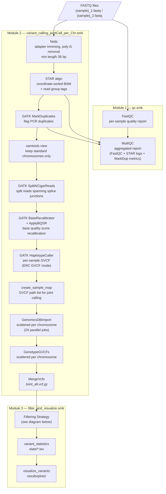
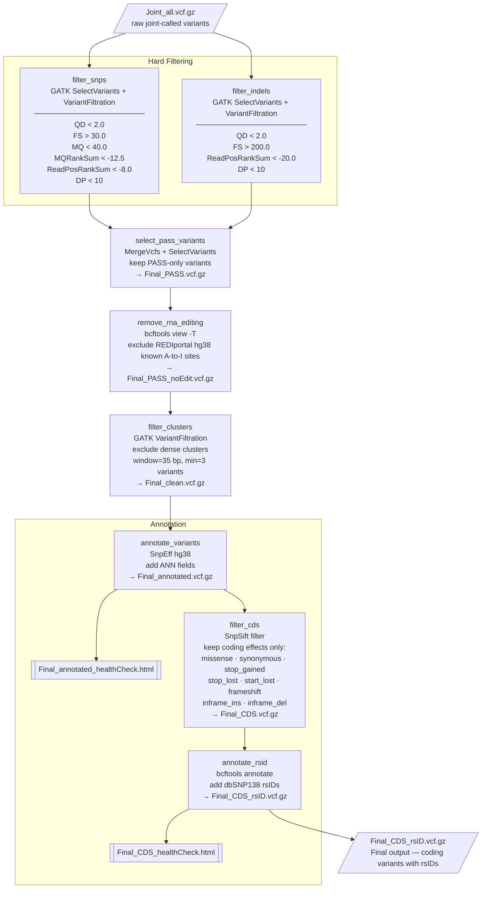

# Snakemake GATK RNA-seq Variant Calling Workflow

A reproducible Snakemake pipeline for RNA-seq variant calling following GATK
Best Practices. Supports both local workstations and HPC/Slurm environments.
Every scientific tool (STAR, GATK, fastp, FastQC, MultiQC, bcftools, SnpEff,
SnpSift, SRA toolkit) runs inside a pinned Singularity/Apptainer container —
the only software you install on the host is Snakemake itself.

---

## Features

- Paired-end and single-end FASTQ support (set one flag in config)
- Adapter trimming with fastp
- Raw read quality control with FastQC + MultiQC
- STAR 2-pass alignment with read group tagging
- GATK Best Practices: MarkDuplicates → SplitNCigarReads → BQSR → HaplotypeCaller
- Scalable joint genotyping: GenomicsDBImport + GenotypeGVCFs scattered per chromosome
- Type-specific hard filtering (SNP and INDEL, RNA-seq tuned thresholds)
- RNA editing site removal (REDIportal hg38)
- Dense variant cluster filtering
- Functional annotation with SnpEff (hg38)
- CDS-only filter: retains coding variants (missense, frameshift, stop, etc.)
- rsID annotation from dbSNP138
- Publication-quality figures (6 plots, PNG + PDF)
- Runs locally or on Slurm HPC with no code changes

---

## Pipeline Workflow

The pipeline is split into three rule modules, executed in order.



> **Parallelism**: HaplotypeCaller runs per sample in parallel. GenomicsDBImport
> and GenotypeGVCFs each run as 24 independent jobs (one per chromosome — chr1–22, chrX, chrY),
> then MergeVcfs collects the results.

---

## Filtering Strategy



---

## Repository Structure

```
.
├── Snakefile                          # Main entry point
├── run.sh                             # Unified runner — local OR SLURM (auto-detect)
├── config/
│   └── config.yaml                    # All user-facing settings
├── workflow/
│   ├── envs/
│   │   └── snakemake.yaml             # Snakemake 9 + slurm executor plugin (only host-side env)
│   ├── profiles/
│   │   ├── local/config.yaml          # Snakemake profile for local runs
│   │   └── slurm/config.yaml          # Snakemake profile for SLURM HPC runs
│   ├── rules/
│   │   ├── qc.smk                     # Module 1: FastQC + MultiQC
│   │   ├── variant_calling_jointCall_per_Chr.smk   # Module 2: fastp → STAR → GATK
│   │   └── filter_and_visualize.smk   # Module 3: filtering → annotation → plots
│   └── scripts/
│       ├── download_refs.sh           # Download all reference databases
│       ├── download_refs.slurm        # Thin SLURM wrapper around download_refs.sh
│       ├── download_GSE256519.sh      # Download example test data (SRA)
│       ├── download_GSE256519.slurm   # SLURM wrapper for the test-data download
│       └── visualize_variants.py      # Variant visualization script
├── resources/                         # Reference files (not tracked by git)
└── data/                              # Input FASTQ files (not tracked by git)
```

> **Files an HPC reader must touch:** none. Set the two env vars
> `SLURM_ACCOUNT` and `SLURM_PARTITION` for your cluster (see Usage Example).
> Local readers edit nothing.

---

## Requirements

- **Snakemake** — the only host-side software you must install.
  Install however you prefer:
  ```bash
  conda env create -f workflow/envs/snakemake.yaml      # or: mamba / micromamba
  conda activate snakemake_env
  ```
  Other valid options: `pip install snakemake snakemake-executor-plugin-slurm`
  in a venv, or `module load snakemake` on HPC systems with environment modules.
- **Apptainer or Singularity** — required. Every scientific tool runs from a
  pinned biocontainer pulled on first use.
- No manual installation of GATK, STAR, samtools, SnpEff, SnpSift, SRA toolkit,
  bcftools, etc. — they all run from containers.

Run `bash workflow/scripts/check_prerequisites.sh` to verify your host before
starting.

---

## Reference Files

Download all required references with the provided script. Output paths
already match `config/config.yaml`, so no edits are required afterwards.
Step 5/5 (SnpEff hg38 database) runs `snpEff` from the same biocontainer
the pipeline uses — apptainer/singularity must be on PATH.

```bash
# Local (or HPC interactive node):
bash workflow/scripts/download_refs.sh

# HPC via SLURM — uses the same env vars as run.sh (set them once per shell):
export SLURM_ACCOUNT=<your_slurm_account>
export SLURM_PARTITION=<your_slurm_partition>
bash workflow/scripts/download_refs.slurm   # self-submits via sbatch
```

This downloads:

| File | Source | Used by |
|---|---|---|
| GRCh38 primary assembly FASTA | EBI / GENCODE | STAR index, GATK |
| GENCODE v44 GTF | EBI / GENCODE | STAR index |
| Mills & 1000G gold standard indels (hg38) | Broad Institute | BQSR |
| dbSNP138 hg38 VCF | Broad Institute | BQSR, rsID annotation |
| REDIportal v2.0 hg38 BED | rediportal.cloud.ba.infn.it | RNA editing filter |
| SnpEff hg38 database | snpeff.blob.core.windows.net | Functional annotation |

---

## Configuration

All settings are in `config/config.yaml`:

```yaml
fastq_dir: "data/GSE256519"      # Directory containing input FASTQ files
output_dir: "results"
log_dir: "logs"

sequencing_type: "paired"        # "paired" or "single"
                                 # paired  → {sample}_1.fastq + {sample}_2.fastq
                                 # single  → {sample}.fastq
```

Sample names are discovered automatically by globbing `fastq_dir` at runtime —
no sample list needed.

---

## Usage Example

The following walks through a complete run from a fresh clone to final results,
using the GSE256519 test dataset (human heart RNA-seq, paired-end 2×150 bp).

### Step 1 — Clone the repository

```bash
git clone https://github.com/ManHUU/snakemake-gatk-rna-workflow.git
cd snakemake-gatk-rna-workflow
```

### Step 2 — Install Snakemake (pinned)

```bash
conda env create -f workflow/envs/snakemake.yaml
conda activate snakemake_env
```

### Step 3 — Download reference files

On a local workstation:
```bash
bash workflow/scripts/download_refs.sh
```

On HPC, set the two SLURM env vars once (same ones used by `run.sh` later),
then launch the wrapper — it self-submits via sbatch:
```bash
export SLURM_ACCOUNT=<your_slurm_account>
export SLURM_PARTITION=<your_slurm_partition>
bash workflow/scripts/download_refs.slurm
```

This places all references under `resources/` and the paths in `config/config.yaml`
match without any edits.

### Step 4 — Download input FASTQ data

The wrapper auto-detects local vs SLURM execution and reuses the same
`SLURM_ACCOUNT` / `SLURM_PARTITION` env vars from Step 3. The SRA Toolkit
runs from a pinned biocontainer pulled on first use — no conda env required.

```bash
bash workflow/scripts/download_GSE256519.slurm
```

> **Note:** This downloads the GSE256519 test dataset. To use your own data,
> place your FASTQ files directly in `data/` (or any directory of your choice)
> and update `fastq_dir` in `config/config.yaml` to point to it.

After this you should have:
```
data/GSE256519/
├── SRR28074879_1.fastq
├── SRR28074879_2.fastq
├── SRR28074880_1.fastq
└── SRR28074880_2.fastq
```

Samples are discovered automatically — no need to edit the config.

### Step 5 — Dry run (verify the DAG)

```bash
bash run.sh --dry-run
```

You should see all rules listed for both samples across 24 chromosomes with no errors.

### Step 6 — Run the pipeline

```bash
bash run.sh
```

`run.sh` runs locally on workstations, or self-submits via `sbatch` on HPC
when `SLURM_ACCOUNT` / `SLURM_PARTITION` are exported. See
[Running the Pipeline](#running-the-pipeline) below for full details
(screen sessions, `EXTRA_BIND_PATHS`, etc.).

### Step 7 — Check outputs

```bash
# Final variant file
ls -lh results/Final_CDS_rsID.vcf.gz

# QC report
xdg-open results/qc/multiqc_report.html

# SnpEff health check
xdg-open results/Final_CDS_healthCheck.html

# Figures
ls results/plots/
```

### Expected output summary

```
results/
├── qc/
│   └── multiqc_report.html          # FastQC + STAR + MarkDuplicates QC
├── Final_CDS_rsID.vcf.gz            # Final output: coding variants with rsIDs
├── Final_annotated_healthCheck.html # SnpEff report (all variants)
├── Final_CDS_healthCheck.html       # SnpEff report (coding variants only)
├── stats/
│   ├── quality_metrics.tsv
│   ├── filter_summary.tsv
│   ├── chrom_counts.tsv
│   ├── sample_counts.tsv
│   └── ts_tv.tsv
└── plots/
    ├── variant_type_summary.png / .pdf
    ├── filter_summary.png / .pdf
    ├── quality_distributions.png / .pdf
    ├── chrom_distribution.png / .pdf
    ├── sample_counts.png / .pdf
    └── ts_tv_comparison.png / .pdf
```

---

## Running the Pipeline

A single entrypoint, `run.sh`, handles both modes via auto-detection.

### Local workstation

```bash
bash run.sh             # full run
bash run.sh --dry-run   # preview steps only
```

For long runs, launch from a `screen` (or `tmux`) session so the run survives
disconnection:
```bash
screen -S gatk_run
bash run.sh
# Detach with Ctrl+A then D; reattach later with `screen -r gatk_run`
```

The local profile uses 8 cores by default. Edit
`workflow/profiles/local/config.yaml` to change.

### HPC / SLURM

```bash
export SLURM_ACCOUNT=<your_account>
export SLURM_PARTITION=<your_partition>

bash run.sh --dry-run   # plans the DAG on the head node, submits nothing
bash run.sh             # self-submits an orchestrator job that scatters per-rule jobs
sbatch run.sh           # equivalent explicit form
```

Optionally bind extra paths into containers (e.g. cluster scratch):
```bash
export EXTRA_BIND_PATHS=/scratch-shared,/tmp
```

`run.sh` auto-detects whether you are on a SLURM-capable machine, dynamically
binds the current working directory into all containers, and forwards the
SLURM account/partition to per-rule submissions.

---

## HPC tip: redirect apptainer scratch (optional, recommended for speed)

By default, apptainer builds container images inside the repo at
`resources/containers/tmp/`. This always works, but on most HPC sites a
dedicated scratch filesystem is faster and has more headroom. To use it,
set `APPTAINER_TMPDIR` to your site's scratch path before running:

```bash
export APPTAINER_TMPDIR=/scratch-shared/$USER/apptainer-tmp   # Snellius
export APPTAINER_TMPDIR=/scratch/$USER/apptainer-tmp          # many SLURM sites
export APPTAINER_TMPDIR=$SCRATCH/apptainer-tmp                # NERSC/TACC
```

If unsure, check your cluster's documentation for "scratch" or "temporary
storage". The pipeline will fall back to the in-repo default if unset.

---

## Outputs

| Path | Description |
|---|---|
| `results/qc/multiqc_report.html` | Aggregated QC (FastQC + STAR + MarkDuplicates) |
| `results/Joint_all.vcf.gz` | Raw joint-called variants (pre-filter) |
| `results/Final_PASS.vcf.gz` | Hard-filtered PASS variants |
| `results/Final_PASS_noEdit.vcf.gz` | RNA editing sites removed |
| `results/Final_clean.vcf.gz` | Dense clusters removed |
| `results/Final_annotated.vcf.gz` | SnpEff functional annotation |
| `results/Final_CDS.vcf.gz` | Coding variants only |
| `results/Final_CDS_rsID.vcf.gz` | **Final output** — coding variants with rsIDs |
| `results/Final_annotated_healthCheck.html` | SnpEff summary (all variants) |
| `results/Final_CDS_healthCheck.html` | SnpEff summary (coding variants) |
| `results/stats/quality_metrics.tsv` | Per-variant QD, FS, MQ, DP (pre-filter) |
| `results/stats/ts_tv.tsv` | Ts/Tv ratio before and after filtering |
| `results/plots/` | 6 publication-quality figures (PNG + PDF) |

### Figures generated

| Figure | Description |
|---|---|
| `variant_type_summary` | SNP / INDEL counts, PASS vs filtered |
| `filter_summary` | Total PASS vs filtered (log scale) |
| `quality_distributions` | QD and DP histograms per variant type |
| `chrom_distribution` | Per-chromosome variant counts |
| `sample_counts` | Per-sample coding variant counts |
| `ts_tv_comparison` | Ts/Tv counts and ratio before vs after filtering |

---

## Containers

All containers are pulled automatically on first run and cached in
`resources/containers/`.

| Tool | Container | Version |
|---|---|---|
| STAR | quay.io/biocontainers/star | 2.7.11b |
| samtools | quay.io/biocontainers/samtools | 1.19 |
| GATK | broadinstitute/gatk | 4.6.1.0 |
| fastp | quay.io/biocontainers/fastp | 0.23.4 |
| FastQC | quay.io/biocontainers/fastqc | 0.12.1 |
| MultiQC | quay.io/biocontainers/multiqc | 1.21 |
| bcftools | quay.io/biocontainers/bcftools | 1.21 |
| SnpEff | quay.io/biocontainers/snpeff | 5.3.0a |
| SnpSift | quay.io/biocontainers/snpsift | 5.3.0a |
| SRA Toolkit | quay.io/biocontainers/sra-tools | 3.1.1 |
| matplotlib | quay.io/biocontainers/matplotlib | 3.5.1 |

---

## Test Data

The pipeline was developed using human heart RNA-seq data from GEO dataset
GSE256519 (paired-end 2×150 bp). The bundled wrapper downloads accessions
SRR28074879 and SRR28074880 into `data/GSE256519/` (see
[Usage Example § Step 4](#step-4--download-input-fastq-data) for the full
walkthrough):

```bash
bash workflow/scripts/download_GSE256519.slurm
```

---

## License

See LICENSE file.
